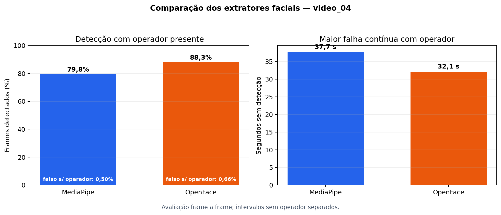

# Resultado direto — comparação de extratores faciais

## Resultado principal

No **video_04**, foram avaliados **31.790 frames**. O resultado abaixo mede
disponibilidade da face e continuidade da extração; não mede, sozinho, precisão dos landmarks.

| Extrator | Frames | Detecção com operador | Falso positivo sem operador | Maior falha contínua |
|---|---:|---:|---:|---:|
| MediaPipe | 31.790 | 79,81% | 0,50% | 37,7 s |
| OpenFace | 31.790 | 88,32% | 0,66% | 32,1 s |

- **OpenFace:** diferença de detecção com operador presente de 8,51 p.p. em relação ao MediaPipe (IC95% por blocos de 5 s: 5,92 a 11,38 p.p.).

## Interpretação

O candidato com maior cobertura pode reduzir lacunas nas séries temporais. Porém, os valores de
EAR, MAR e pose não são numericamente intercambiáveis entre frameworks. Antes de alimentar um
modelo já treinado, thresholds e normalização precisam ser recalibrados ou o modelo deve ser
retreinado com o novo extrator.

- Os indicadores do OpenFace não devem substituir os do MediaPipe sem recalibração: as correlações observadas variaram de 0,06 a 0,87.

## Limites desta entrega

- resultado de um vídeo e um operador;
- comparação contra o MediaPipe, não contra landmarks anotados manualmente;
- OpenFace não fornece latência por frame comparável neste pipeline;
- intervalos de confiança usam bootstrap em blocos temporais de 5 segundos.

## Próximo passo mínimo

Executar exatamente a mesma análise nos demais vídeos já extraídos. Não é necessário criar uma
nova bateria de smoke tests. A decisão prática deve usar cobertura com operador presente, falsos
positivos sem operador e estabilidade entre vídeos.
